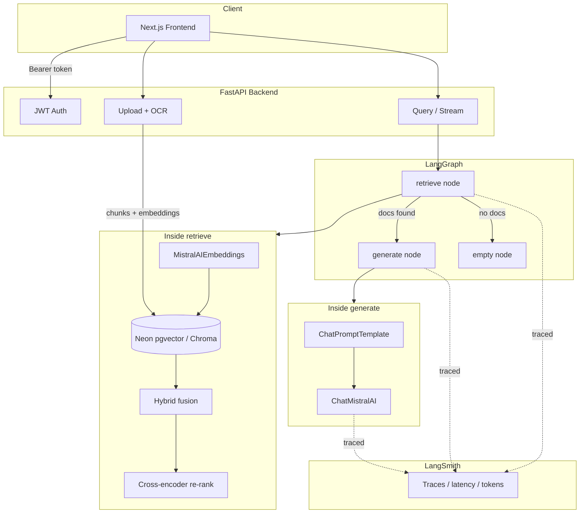
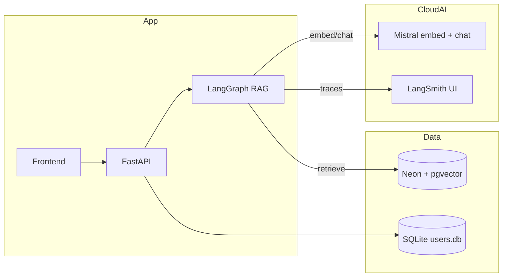

# Chat with your PDFs — Architecture + LangGraph / LangSmith

## Current architecture (what you have now)



### Request lifecycle (simple)

1. **Register / login** → JWT  
2. **Upload PDF** → text or OCR → chunk → embed → **Neon `document_chunks`** (scoped by `user_id`)  
3. **Ask question** → LangGraph `retrieve` (vector + hybrid + re-rank) → `generate` (Mistral) → stream answer + citations  
4. **LangSmith** (optional key) records each run for debugging  

---

## LangGraph + LangSmith — yes, possible (now wired)

| Tool | Role in this project |
|------|----------------------|
| **LangGraph** | Explicit graph: `retrieve → generate` (or `empty`) instead of a flat LCEL-only path |
| **LangSmith** | Cloud monitor: traces, latency, token usage, failed steps |

They do **not** replace Neon or auth. They sit on top of your existing RAG.

### Target architecture (with monitoring)



---

## Setup LangSmith

1. Create account: https://smith.langchain.com  
2. Create an API key  
3. In `backend/.env`:

```env
LANGSMITH_TRACING=true
LANGSMITH_API_KEY=lsv2_pt_...
LANGSMITH_PROJECT=genai-rag
```

4. Restart uvicorn  

5. Ask a question in the UI → open LangSmith → project **genai-rag** → see runs for retriever + ChatMistralAI / LangGraph  

Without a key, the app still works; `/health` shows `"langsmith_tracing": false`.

---

## Validate

```bash
cd backend
venv\Scripts\activate
pip install -r requirements.txt
uvicorn main:app --reload --port 8001
```

| Check | Expect |
|--------|--------|
| `GET /health` | `langgraph_enabled: true`, `langchain.orchestration: langgraph` |
| Logs on startup | `LangGraph RAG compiled` |
| With API key | `LangSmith tracing ON` + runs in smith.langchain.com |
| Ask a question | Answer + sources unchanged; LangSmith shows retrieve then generate |
| No docs | Graph takes `empty` path → “No documents have been uploaded yet.” |

---

## Config summary

```env
VECTOR_BACKEND=pgvector
DATABASE_URL=postgresql://...
LANGSMITH_TRACING=true
LANGSMITH_API_KEY=...
LANGSMITH_PROJECT=genai-rag
```

Toggle tracing off anytime with `LANGSMITH_TRACING=false`.
